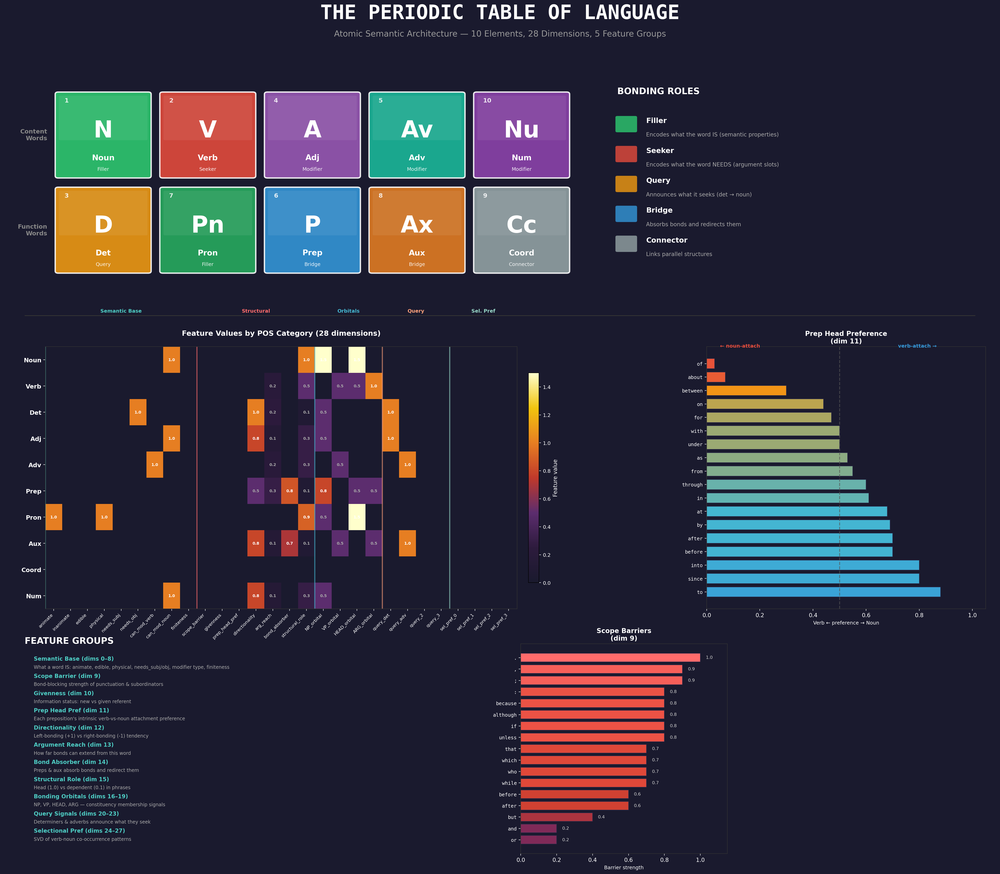

# Atomic Semantic Architecture (ASA)

Research begun December 2025 · 125+ experiments on A100 GPU

<p align="center">
  
</p>

---

## The Core Question

Everything in physical reality reduces to numerical code.

A carbon atom isn't carbon because someone labeled it that way. It's carbon because it has exactly 6 protons. That number determines its electron configuration. That configuration determines its bonding behavior. That bonding behavior determines what molecules it can form.

The entire physical universe — every material, every chemical reaction, every structure from DNA to diamond — emerges from a small set of numerical properties following a small set of rules. The periodic table isn't a human invention. It's a discovery. The rules were already there.

**ASA asks: what if language has an equivalent structure?**

Not loosely. Not as a metaphor. What if words carry inherent structural properties — part of speech, valence, selectional features — that predetermine how they can combine, what roles they can fill, what relationships they can form? These properties are already well-documented in linguistics. They've just never been systematically applied to how we build language models.

If that structural code exists, and if it can be encoded directly into model architectures, then a large portion of what transformers spend billions of parameters learning might not need to be learned at all. That's the hypothesis this project is testing.

---

### Why It Matters

Every generation of frontier AI models is bigger than the last. More parameters, more data, more compute, more energy, more money. GPT-4 reportedly cost over $100 million to train. The next generation will cost more.

This concentrates AI capability in the hands of a very small number of corporations. The standard approach to making models smaller — distillation, quantization, pruning — starts with a massive model and squeezes it down.

But there's another path: what if the models are bloated in the first place? What if a huge portion of those parameters are dedicated to rediscovering structure that didn't need to be learned at all?

If predetermined structure can replace learned structure, that's a path toward models that are dramatically smaller — small enough to run locally, owned by the people running them.

### What Transformers Relearn From Scratch

Every transformer computes the relationship between every possible pair of tokens, then throws most of those computations away. In a 4,096-token context window, that's roughly 16 million pairwise comparisons. After softmax, the vast majority collapse to near zero.

But linguistics has known for a long time which pairs actually matter. Adverbs modify verbs, not nouns. Determiners attach to noun phrases. Transitive verbs require animate agents.

"The rock examined the patient" doesn't just sound wrong. It violates a categorical rule about the verb "examined," which requires an animate experiencer. This is documented in frameworks like VerbNet, Universal Dependencies, and Binding Theory.

Every transformer relearns these rules from scratch. Billions of parameters spent rediscovering structure that's been mapped out in linguistic theory for decades.

---

### The Chemistry Analogy

ASA is built on the idea of **Immanent Semantics** — the hypothesis that linguistic structure can live in the data representation itself, not just in learned weights.

Atoms don't compute compatibility with every other atom and filter the results. They have electron configurations that determine bonding behavior up front. Carbon forms four bonds. Oxygen forms two.

The mapping to language turns out to be surprisingly direct:

| Chemistry | ASA Equivalent | Function |
| :--- | :--- | :--- |
| **Atomic Number** | **Part of Speech + Core Meaning** | Fundamental identity of the token |
| **Electron Shells** | **Selectional Features** | Which bonds the token can form |
| **Valence** | **Argument Slots** | How many connections the word requires |
| **Charge** | **Activation State** | Unfilled slots "seek" a bond |
| **Equilibrium** | **Parsed Sentence** | All structural forces balanced |

If known linguistic properties are encoded directly into token representations, it becomes possible to predetermine which pairs are worth computing before attention ever fires.

---

### Wave Functions

The first version of ASA just blocked incompatible pairs and let normal attention handle the rest. But that's still computing the full matrix and throwing results away.

A more natural approach: represent each token as a wave function over relational bases.

$$\text{token} = \sum_{r} a_r \phi_r$$

Each word is like a chord — made up of individual notes (relational bases), with each note's volume (amplitude) encoding a structural property. Attention between two tokens becomes their wave function overlap:

$$\text{score}(i, j) = \langle \psi_i | \psi_j \rangle = \sum_{r} a_i^{(r)} a_j^{(r)}$$

If two words share no relational bases, their overlap is zero by construction. No masking needed. The zeros are natural.

### Semantic Molecular Dynamics (SMD)

Taking the chemistry analogy further: what if bonding isn't something you add to attention, but **bonding IS the computation?**

In chemistry, molecular structure emerges from local forces. The system relaxes to its lowest energy configuration. Applied to language: tokens become particles with charge and typed bonding sites. Compatible sites attract. The equilibrium configuration IS the attention pattern.

$$E_{ij} = \underbrace{- \frac{\mathbf{q}_i \cdot \mathbf{k}_j}{\sqrt{d}}}_{\text{Alignment}} + \underbrace{\Delta H_{ij}}_{\text{Enthalpy}} - \underbrace{\lambda (q_i \cdot q_j)}_{\text{Charge}}$$

We implemented this as a differentiable attention mechanism: the energy function is computed from periodic features, and iterative gradient steps find the minimum-energy attention pattern. The entire process is backpropagable. This produced the strongest experimental results (see State of the Research below).

---

### Theoretical Extensions (Not Yet Implemented)

The framework suggests several directions we haven't built yet:

**Hyperbolic geometry for non-projective dependencies.** Chemical bonds are local, but language has long-range dependencies. Hyperbolic space expands exponentially, making it a natural topology for hierarchical trees — words far apart in a sentence could be structurally adjacent. This could allow local bonding forces to handle displaced subjects, relative clauses, and other non-projective structures without global search.

**Dynamic temperature control.** A meta-learner could adjust the system's temperature based on context — low temperature for precise, structured outputs (code, logic), high temperature for creative exploration (brainstorming, poetry). This maps directly to how thermodynamic systems behave: frozen crystals vs. hot gases.

**Working memory as a molecular graph.** Across a conversation, bonded structures could persist as a growing molecular graph, with new utterances bonding to existing structure rather than being processed in isolation.

These are speculative. They follow naturally from the framework but haven't been tested. The question of whether language structure goes this deep — whether there's a complete "physics of language" analogous to the physics of matter — is what motivates the research, even if the answer turns out to be "only partially."

---

## State of the Research

The sections above describe the theory. Below is what we've actually built and found. 125+ experiments on an A100 80GB GPU, December 2025 through March 2026. Many of these were run using [@karpathy's autoresearch](https://github.com/karpathy/autoresearch) methodology.

### The Periodic Table of Language

Through autonomous discovery on Penn Treebank dependency trees, we identified **28 numerical dimensions** organized into 5 groups that describe the structural properties of any word:

| Group | Dimensions | What It Encodes |
|-------|-----------|-----------------|
| **Semantic Base** | 9 dims | What a word IS: animate, edible, physical, needs subject/object, modifier type, finiteness |
| **Structural Properties** | 7 dims | Scope barriers, givenness, prep attachment preference, directionality, argument reach, bond absorption, structural role |
| **Bonding Orbitals** | 4 dims | NP, VP, HEAD, ARG — constituency membership signals |
| **Query Signals** | 4 dims | Determiners and adverbs announce what they seek |
| **Selectional Preference** | 4 dims | SVD-compressed verb-noun co-occurrence patterns |

These features are extracted from established linguistic resources (WordNet, VerbNet) and assigned to every word in the vocabulary. They are **not learned** — they are predetermined, just as electron configurations are predetermined by atomic number.

The table was validated as **complete at 28 dimensions**: expanding to 34 with 6 additional candidate elements produced no improvement.

### Zero-Learning Dependency Parsing

Before any neural networks, we built a pure-physics parser (`src/toy/asa_toy.py`) that parses sentences using energy minimization with **zero learned parameters**:

```
Input: "the big dog quickly eat the red apple with a fork"

Output:
  eat [VERB, val=2]
  ├── subj: dog [NOUN]
  │   ├── det→: the [DET]
  │   └── adj→: big [ADJ]
  ├── obj: apple [NOUN]
  │   ├── det→: the [DET]
  │   └── adj→: red [ADJ]
  ├── adv→: quickly [ADV]
  └── pp→: with [PREP]
      └── comp: fork [NOUN]
          └── det→: a [DET]
```

This parser achieves **F1=0.669 on the Penn Treebank** — recovering two-thirds of gold-standard dependency bonds with no training whatsoever, using only the periodic table features and energy minimization (simulated annealing). The errors are informative: they point to exactly which linguistic properties are missing from the table.

### Integration Architectures

We tested four ways to use the periodic table inside a transformer. The failures were as informative as the successes:

- **v2 (additive bias):** `score = QK^T/√d + α·bias` — too weak. POS-level features ≈ random mask at same sparsity.
- **v3 (MLP attention):** `score = MLP(feat_i, feat_j)` — too flexible. Memorized word pairs instead of generalizing.
- **v3b (projection attention):** `score = (W_q·feat_i)·(W_k·feat_j)^T/√d` — **validated.** Constrained bilinear forces generalization. 14K periodic Q/K parameters beat 66K standard Q/K parameters (p=0.003).
- **SMD (energy minimization):** Iterative relaxation over feature-based energy function — **strongest results** at small scale.

### Key Results

| Finding | Evidence |
|---------|----------|
| **Periodic table is real** | Real features beat random beat standard (p=0.003) |
| **14K beats 66K** | Fewer learned params with structure > more params without |
| **Wave-gated FFN** | 1.19x compression, better quality (t=9.05, p<<0.001) |
| **2x compression** | 1-layer wave = 6-layer standard (t=15.11, p<<<0.001) |
| **SMD at d=256** | Perplexity 113.0 vs 121.5 standard (**-7.0%**, p<0.0001) |
| **SMD at d=512** | Perplexity 99.2 vs 106.3 standard (**-6.7%**, p=0.000024) |
| **Sequence length scaling** | Wave advantage grows with context length |
| **Training stability** | 2-7x lower variance at all model scales |

### The Compression Curve

From 105 experiments on TinyStories, wave-gated models produce a clear compression curve:

| Compression | Quality vs Standard | Method |
|:-----------:|:-------------------:|--------|
| 1.19x | **better** (+0.178) | Wave-gated FFN (5-trial, t=9.05) |
| 1.33x | **better** (+0.095) | 3-layer wave vs 6-layer standard |
| 1.50x | ~tied | Practical compression boundary |
| 2.0x | small cost (-0.02) | 1L d=512 seq=512 vs 6L standard |

### SMD: Energy Minimization as Attention

The SMD architecture — where attention patterns are *computed through energy minimization* rather than looked up via a single matrix multiply — produced the strongest results:

| Scale | SMD Perplexity | Standard Perplexity | Improvement | p-value |
|-------|---------------|--------------------:|------------:|--------:|
| d=256 (8.3M params) | 113.0 | 121.5 | **-7.0%** | < 0.0001 |
| d=512 (29M params) | 99.2 | 106.3 | **-6.7%** | 0.000024 |
| 16 relaxation steps | 84.8 | 121.5 | **-30.2%** | — |

More relaxation steps monotonically improve quality — the system genuinely converges to better attention patterns through iterative energy minimization, exactly as the theory predicts.

### Where It Stands

This is active research, not a finished product. The results are real and statistically validated, but they come with important context:

- All experiments are at 8-29M parameters. The advantage is strongest where models are most parameter-constrained.
- Most results are single-epoch. With extended training, standard transformers narrow the gap — they eventually learn the structure we encode.
- The core question remains: does this approach produce advantages that persist at frontier scale, or is it primarily valuable for small, efficient models?

Either answer is interesting. If structural priors help at small scale, that's a path to capable models that run locally. If they don't scale, that tells us something fundamental about what large models are actually doing with their parameters.

---

## Repository Structure

```
├── README.md                    ← You are here
├── ASA_RESEARCH_BRIEF.md        ← Technical research brief
├── ASA Whitepaper.pdf           ← Whitepaper
├── src/
│   ├── toy/                     ← Pure-physics parser (zero learning)
│   │   └── asa_toy.py
│   ├── transformer/             ← ASA attention as transformer drop-in
│   │   ├── model.py             ← ASAAttention, compute_asa_bias, 4 ablation modes
│   │   ├── train.py             ← WikiText-2 training, VerbNet/WordNet extraction
│   │   └── test_model.py
│   ├── wave/                    ← Wave function attention + FFN gating
│   │   ├── wave_model.py        ← Wave heads, wave-gated FFN
│   │   ├── train_wave.py
│   │   └── combined_model.py    ← Periodic + wave combined architecture
│   ├── smd/                     ← Semantic Molecular Dynamics
│   │   ├── smd_attention.py     ← Energy minimization attention layer
│   │   ├── smd_1b.py            ← 1.3B parameter architecture
│   │   └── smd_experiment.py
│   ├── periodic/                ← Periodic table of language
│   │   ├── periodic_features.py ← 28-dim feature extraction (WordNet/VerbNet)
│   │   ├── periodic_attention.py← Projection attention (v3b)
│   │   └── discover_elements.py ← Automated element discovery
│   └── experiments/             ← Experiment scripts
│       ├── eval_treebank.py     ← Penn Treebank evaluation
│       ├── compression_sweep.py ← Systematic compression experiments
│       └── ...
├── results/                     ← Experiment data and findings
│   ├── FINDINGS.md              ← Comprehensive results (118+ experiments)
│   └── data/                    ← Raw experiment results (JSON/TSV)
├── figures/                     ← Visualizations
│   └── periodic_table.png       ← The periodic table of language
└── references/                  ← Background papers and prior work
```

## Getting Started

### Toy Parser (no dependencies beyond numpy)

```bash
python -m venv venv && source venv/bin/activate
pip install numpy
python src/toy/asa_toy.py
```

### Transformer Training (requires PyTorch + NLTK)

```bash
pip install torch nltk
python -c "import nltk; nltk.download('averaged_perceptron_tagger_eng'); nltk.download('wordnet')"
python src/transformer/train.py --compare --epochs 3
```

### SMD Experiments (requires GPU)

```bash
python src/smd/smd_experiment.py
```

---

## Contributing

Looking for:

- **Collaborators** interested in scaling these experiments (multi-epoch, larger datasets, bigger models)
- **Linguists** who can identify missing elements in the periodic table
- **ML researchers** exploring structural priors, sparse attention, or physics-inspired architectures

## How to Cite

```
@misc{jkillr2026asa,
  title={Atomic Semantic Architecture: Encoding Linguistic Structure as Predetermined Bonding Physics},
  author={JKILLR},
  year={2026}
}
```

## License

MIT License. See individual files for details.

---

*"The periodic table isn't a human invention. It's a discovery. The rules were already there."*
